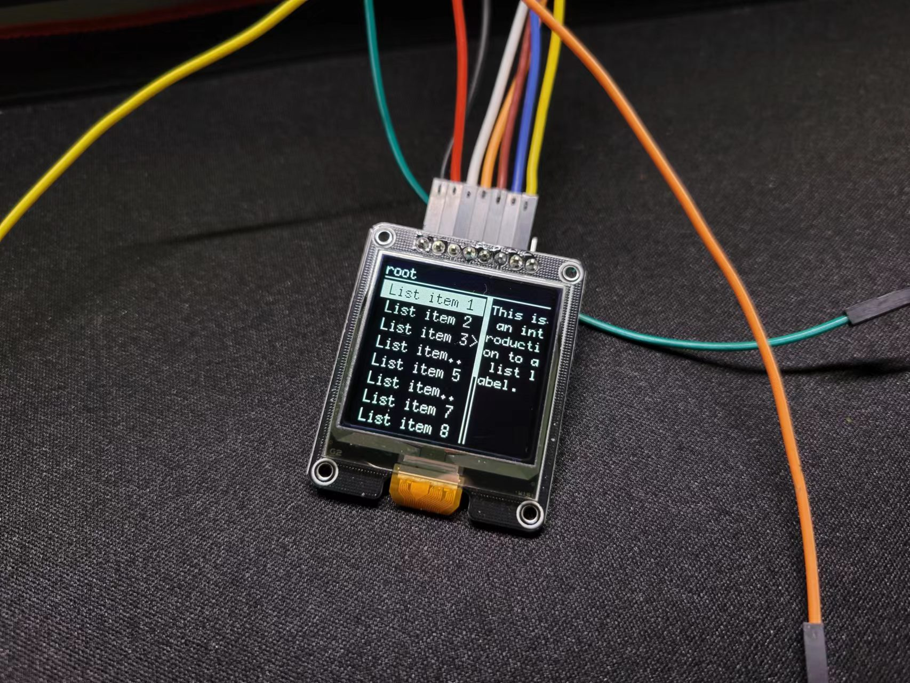

<!--
 * @Author: feoar feoar@outlook.com
 * @Date: 2023-06-30 22:54:03
 * @LastEditors: feoar feoar@outlook.com
 * @LastEditTime: 2023-07-01 21:53:22
 * @FilePath: /Menu_SSD1327_S3/README.md
 * @Description: 
-->
# 概述
用C++的软件思想写了一个Menu，我的评价是思路过于迂回，其中因为依赖Mep容器导致非常多的地方需要不停遍历整个容器，十分低效，字符串处理也是非常的不优雅，总之会抽时间不断优化。
开发这个菜单之前没有经过软件设计，或是只有大概的规划，没阅读或参考当前优秀项目，属于闭门造车。虽然架构一欧一些问题，但是也是可以改的，主要功能逻辑都是正常的。

这里使用的是Esp32S3开发板，使用硬件SPI，其他引脚连接如下：
|NAME|GPIO|
|:-:|:-:|
|touchPinA|4|
|touchPinB|5|
|touchPinC|6|
|cs|10|
|dc|16|
|rest|17|

# 使用
用户移植这个Menu只需要在UIdesign.cpp中的listInit()函数内根据规律添加条目即可。

# 预览

# B站
[链接](https://www.bilibili.com/video/BV1Ph411A7j6)